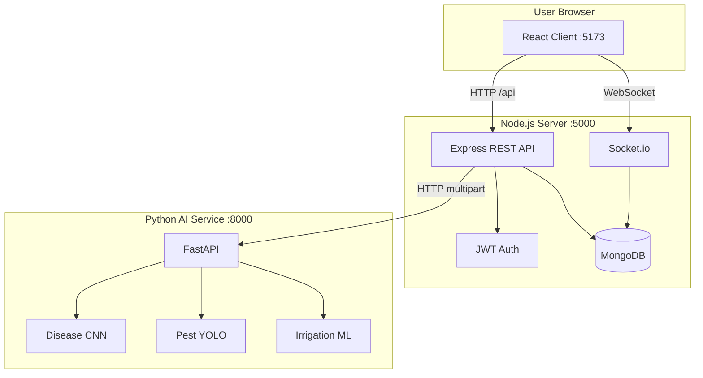

# AI Crop Guardian — Complete Project Documentation

**Precision Farming Intelligence Platform**

This folder is the **single source of truth** for understanding the entire project: architecture, features, setup, APIs, database, AI pipeline, and deployment.

---

## Table of Contents

1. [What Is This Project?](#1-what-is-this-project)
2. [System Architecture](#2-system-architecture)
3. [Repository Structure](#3-repository-structure)
4. [Technology Stack](#4-technology-stack)
5. [How Services Work Together](#5-how-services-work-together)
6. [Features Explained](#6-features-explained)
7. [Database Design](#7-database-design)
8. [Backend (Node.js API)](#8-backend-nodejs-api)
9. [AI Microservice (Python FastAPI)](#9-ai-microservice-python-fastapi)
10. [Frontend (React App)](#10-frontend-react-app)
11. [Real-Time Notifications](#11-real-time-notifications)
12. [Authentication & Roles](#12-authentication--roles)
13. [Environment Variables](#13-environment-variables)
14. [Installation & Running](#14-installation--running)
15. [Demo Accounts](#15-demo-accounts)
16. [Docker Deployment](#16-docker-deployment)
17. [API Reference](#17-api-reference)
18. [Training Custom ML Models](#18-training-custom-ml-models)
19. [Troubleshooting](#19-troubleshooting)
20. [Future Enhancements](#20-future-enhancements)

---

## 1. What Is This Project?

**AI Crop Guardian** is a full-stack, production-style SaaS platform that helps farmers and agribusinesses use artificial intelligence for day-to-day farm decisions.

### Problems it solves

| Problem | Solution in this app |
|--------|----------------------|
| Crop diseases spread unnoticed | Upload leaf photos → CNN disease detection + treatment advice |
| Over/under irrigation | ML irrigation predictor using soil moisture & weather |
| Pest damage | YOLO-style pest detection with bounding boxes |
| Weather-related crop risk | OpenWeather integration + disease-risk alerts |
| Scattered farm data | Unified dashboard with health score & analytics |
| Need expert advice | Multilingual AI chatbot (EN / Hindi / Gujarati) + voice input |

### Who uses it

- **Farmers** — dashboard, AI tools, crops, reports  
- **Admins** — user management, system stats, AI usage analytics  

---

## 2. System Architecture

The project is a **monorepo** with three runnable applications and shared DevOps config.



### Request flow example (disease detection)

1. Farmer uploads an image on **Disease AI** page (`client`).
2. **Express** receives file via Multer, saves to `server/uploads/`.
3. **Express** forwards image to **FastAPI** `POST /api/v1/disease/detect`.
4. **AI service** runs OpenCV + CNN (or heuristic fallback), returns disease name, confidence, heatmap.
5. **Express** saves `DiseaseReport` in MongoDB, may create a notification.
6. **React** displays results and updates history.

If the AI service is offline, the **server still responds** using built-in fallback logic so the app remains usable.

---

## 3. Repository Structure

```
ai-crop-guardian/
│
├── client/                 # React frontend (Vite)
│   ├── src/
│   │   ├── pages/          # Landing, auth, dashboard modules
│   │   ├── components/     # Layout, UI, chatbot
│   │   ├── store/          # Zustand (auth, theme)
│   │   ├── services/       # Axios API client
│   │   └── hooks/          # useSocket, etc.
│   ├── vite.config.js      # Proxy /api → :5000
│   └── package.json
│
├── server/                 # Node.js backend
│   ├── src/
│   │   ├── index.js        # App entry, Socket.io, routes
│   │   ├── config/         # DB, logger
│   │   ├── models/         # Mongoose schemas
│   │   ├── controllers/    # Business logic
│   │   ├── routes/         # REST endpoints
│   │   ├── services/       # AI proxy, weather, chat
│   │   ├── middleware/     # auth, upload, errors
│   │   ├── utils/          # JWT, Socket handlers
│   │   └── scripts/        # seed.js
│   ├── uploads/            # Uploaded images (runtime)
│   └── .env                # Server secrets
│
├── ai-service/             # Python ML microservice
│   ├── main.py             # FastAPI app
│   ├── routers/            # disease, pest, irrigation
│   ├── services/
│   │   └── ml_inference.py # Core ML + fallbacks
│   ├── models/             # Place trained .h5 / .pt here
│   └── requirements.txt
│
├── docker/                 # Production containers
│   ├── docker-compose.yml
│   ├── Dockerfile.server
│   ├── Dockerfile.client
│   ├── Dockerfile.ai
│   └── nginx.conf
│
├── documentation/          # ← YOU ARE HERE (full project guide)
├── docs/                   # API.md (endpoint reference)
└── README.md               # Quick start (root)
```

---

## 4. Technology Stack

| Layer | Technologies | Purpose |
|-------|--------------|---------|
| **Frontend** | React 18, Vite, TailwindCSS, Framer Motion | UI, animations, responsive design |
| **State** | Zustand | Auth session, dark/light theme |
| **Charts** | Recharts | Dashboard analytics |
| **Backend** | Node.js, Express.js | REST API, file uploads |
| **Database** | MongoDB, Mongoose | Persistent data |
| **Auth** | JWT, bcryptjs | Secure login & roles |
| **Real-time** | Socket.io | Live notifications (e.g. disease alerts) |
| **AI** | FastAPI, OpenCV, TensorFlow*, Ultralytics*, scikit-learn | Inference |
| **DevOps** | Docker, Docker Compose, Nginx | Deployment |

\*TensorFlow / YOLO weights are optional; heuristic fallbacks work without trained files.

---

## 5. How Services Work Together

| Port | Service | Responsibility |
|------|---------|----------------|
| **5173** | `client` | User interface; proxies `/api` to backend in dev |
| **5000** | `server` | Auth, CRUD, orchestration, Socket.io, calls AI service |
| **8000** | `ai-service` | Image & numeric ML inference only |
| **27017** | MongoDB | Data storage |

**Important:** The browser never talks to the AI service directly. All AI calls go through Express for security, logging, and saving results to the database.

---

## 6. Features Explained

### 6.1 Authentication

- Register / login with email & password  
- Passwords hashed with **bcrypt** (12 rounds)  
- **JWT** returned on login; stored in Zustand + `localStorage`  
- Protected routes require `Authorization: Bearer <token>`  
- Forgot password generates a reset token (dev mode may return token in response)  
- Roles: `farmer` | `admin`  

### 6.2 Landing page (`/`)

Marketing site: hero, features, stats, testimonials, contact form, dark mode. No login required.

### 6.3 Disease detection (`/app/disease`)

- Upload crop leaf image  
- AI returns: disease name, confidence %, severity, treatment, prevention  
- Optional **heatmap** (base64 overlay from OpenCV)  
- History stored per user in `diseaseReports` collection  

### 6.4 Pest detection (`/app/pest`)

- Upload field/crop image  
- Returns detections: class, confidence, bounding box `[x1,y1,x2,y2]`  
- Risk level: low / medium / high  

### 6.5 Smart irrigation (`/app/irrigation`)

- Inputs: soil moisture, temperature, humidity, rainfall, crop type, area  
- Outputs: recommended liters, schedule, risk level, text recommendation  

### 6.6 Weather (`/app/weather`)

- Uses **OpenWeatherMap** when `OPENWEATHER_API_KEY` is set  
- Otherwise returns realistic mock data  
- Forecast charts, storm alerts, **disease-risk** rules (e.g. high humidity → fungal risk)  

### 6.7 AI farming assistant (floating chatbot)

- Available on all authenticated pages  
- Languages: English, Hindi, Gujarati  
- **Voice input** via Web Speech API  
- Backends (in order): OpenAI → Gemini → local rule-based replies  

### 6.8 Farm dashboard (`/app/dashboard`)

- Farm health score (derived from crops & diseases)  
- Recent disease reports, notifications  
- Recharts health trend  

### 6.9 Admin panel (`/app/admin`) — admin only

- User counts, disease reports, AI prediction stats  
- Recent users list, AI requests by type chart  

### 6.10 Other modules

| Route | Description |
|-------|-------------|
| `/app/crops` | CRUD for crops with health scores |
| `/app/reports` | Download PDF farm report |
| `/app/profile` | Update profile & password |

---

## 7. Database Design

MongoDB database name (default): `ai_crop_guardian`

| Collection | Purpose | Key fields |
|------------|---------|------------|
| **users** | Accounts | name, email, password, role, farmName, location, language |
| **crops** | Farmer crops | userId, name, variety, area, healthScore, status |
| **diseasereports** | AI disease scans | userId, imageUrl, diseaseName, confidence, severity, treatment |
| **predictions** | Irrigation, pest results | userId, type, input, result |
| **chatbothistories** | Chat messages | userId, role, content, language |
| **notifications** | Alerts | userId, type, title, message, severity, read |
| **weatherlogs** | Cached weather | userId, lat, lon, data, alerts |

Relationships use `userId` (ObjectId) referencing `users._id`.

---

## 8. Backend (Node.js API)

### Entry point

`server/src/index.js` — mounts routes, connects MongoDB, starts HTTP + Socket.io.

### Route map (prefix `/api`)

| Prefix | File | Description |
|--------|------|-------------|
| `/auth` | auth.routes.js | Login, register, password reset |
| `/users` | user.routes.js | Profile, password |
| `/crops` | crop.routes.js | Crop CRUD |
| `/disease` | disease.routes.js | Analyze + history |
| `/pest` | pest.routes.js | Detect + history |
| `/irrigation` | irrigation.routes.js | Predict + history |
| `/weather` | weather.routes.js | Current + forecast |
| `/chat` | chat.routes.js | Chatbot |
| `/notifications` | notification.routes.js | List, mark read |
| `/dashboard` | dashboard.routes.js | Aggregated stats |
| `/admin` | admin.routes.js | Admin-only |
| `/reports` | report.routes.js | PDF export |

### Middleware

- `protect` — validates JWT  
- `authorize('admin')` — role check  
- `upload` — Multer image storage  
- `errorHandler` — centralized errors  
- Rate limit — 200 requests / 15 min per IP  

### Key services

- `aiService.js` — HTTP client to FastAPI  
- `weatherService.js` — OpenWeather + mocks  
- `chatService.js` — OpenAI / Gemini / local replies  

---

## 9. AI Microservice (Python FastAPI)

### Endpoints

| Method | Path | Input |
|--------|------|-------|
| GET | `/health` | — |
| POST | `/api/v1/disease/detect` | Image file |
| POST | `/api/v1/pest/detect` | Image file |
| POST | `/api/v1/irrigation/predict` | JSON body |

### Inference logic (`services/ml_inference.py`)

1. **Disease** — If `models/disease_cnn.h5` exists, use TensorFlow; else analyze green/brown pixels (PlantVillage-style classes).  
2. **Pest** — If `models/pest_yolo.pt` exists, use Ultralytics YOLO; else contour-based demo boxes.  
3. **Irrigation** — Rule-based formulas (crop factors, moisture thresholds).  
4. **Heatmap** — OpenCV colormap overlay on uploaded image.  

Interactive API docs: **http://localhost:8000/docs** (when running).

---

## 10. Frontend (React App)

### Public routes

| Path | Page |
|------|------|
| `/` | LandingPage |
| `/login` | LoginPage |
| `/register` | RegisterPage |
| `/forgot-password` | ForgotPasswordPage |

### Protected routes (`/app/*`)

Wrapped in `DashboardLayout` (sidebar + topbar). Requires login.

### State management

- `authStore` — token, user, login/logout (persisted)  
- `themeStore` — `dark` / `light` (persisted, `class` on `<html>`)  

### API client

`src/services/api.js` — Axios with base URL `/api` (Vite proxy in development).

### UI patterns

- **Glassmorphism** cards (`.glass`, `.glass-card`)  
- **Framer Motion** page and list animations  
- **react-hot-toast** for notifications  
- **PWA** via `vite-plugin-pwa`  

---

## 11. Real-Time Notifications

### Socket.io events

**Client → Server**

- `join-farm` — pass `userId` to join room `farm-{userId}`

**Server → Client**

- `notification` — new alert document (e.g. critical disease detection)

---

## 12. Authentication & Roles

### JWT payload

```json
{ "id": "<user ObjectId>" }
```

### Role permissions

| Action | Farmer | Admin |
|--------|--------|-------|
| Dashboard & AI tools | ✅ | ✅ |
| Admin panel | ❌ | ✅ |
| Manage all users | ❌ | ✅ |

---

## 13. Environment Variables

### Server (`server/.env`)

```env
NODE_ENV=development
PORT=5000
MONGODB_URI=mongodb://localhost:27017/ai_crop_guardian
JWT_SECRET=your-secret-key
JWT_EXPIRES_IN=7d
CLIENT_URL=http://localhost:5173
AI_SERVICE_URL=http://localhost:8000

# Optional
OPENWEATHER_API_KEY=
OPENAI_API_KEY=
GEMINI_API_KEY=
SMTP_HOST=
SMTP_USER=
SMTP_PASS=
```

### AI service (`ai-service/.env`)

```env
MODEL_PATH=./models
PORT=8000
```

Copy from `server/.env.example` if `.env` is missing.

---

## 14. Installation & Running

### Prerequisites

- Node.js 20+  
- Python 3.11+  
- MongoDB running locally or MongoDB Atlas URI  

### Step-by-step

```bash
# 1. Install Node dependencies
cd client && npm install --legacy-peer-deps
cd ../server && npm install

# 2. Install Python dependencies (minimal set for dev)
cd ../ai-service
pip install fastapi uvicorn python-multipart numpy opencv-python-headless Pillow pydantic python-dotenv scikit-learn

# 3. Configure server
cd ../server
copy .env.example .env   # Windows
# Edit MONGODB_URI and JWT_SECRET if needed

# 4. Seed demo data
npm run seed

# 5. Start services (3 terminals)
# Terminal A
cd ai-service && python -m uvicorn main:app --reload --port 8000

# Terminal B
cd server && npm run dev

# Terminal C
cd client && npm run dev
```

Open **http://localhost:5173**

### Health checks

- Frontend: http://localhost:5173  
- API: http://localhost:5000/api/health  
- AI: http://localhost:8000/health  

---

## 15. Demo Accounts

Created by `npm run seed` in `server/`:

| Role | Email | Password |
|------|-------|----------|
| **Admin** | `admin@aicropguardian.com` | `admin123` |
| **Farmer** | `farmer@demo.com` | `farmer123` |

Re-run seed anytime:

```bash
cd server && npm run seed
```

> Warning: seed **deletes** existing users and crops.

---

## 16. Docker Deployment

From project root:

```bash
npm run docker:up
```

Services in `docker/docker-compose.yml`:

| Container | Port |
|-----------|------|
| mongodb | 27017 |
| server | 5000 |
| ai-service | 8000 |
| client (nginx) | 5173 → 80 |

Set `JWT_SECRET` and `MONGODB_URI` via environment before production use.

---

## 17. API Reference

Detailed endpoint tables: **[../docs/API.md](../docs/API.md)**

FastAPI Swagger UI: **http://localhost:8000/docs**

---

## 18. Training Custom ML Models

### Disease (TensorFlow / PlantVillage)

1. Train CNN on PlantVillage dataset (224×224, 10+ classes).  
2. Save as `ai-service/models/disease_cnn.h5`.  
3. Class names must match `DISEASE_CLASSES` in `ml_inference.py` (or update the list).

### Pest (YOLOv8)

1. Train with Ultralytics on pest/insect dataset.  
2. Save as `ai-service/models/pest_yolo.pt`.  
3. Restart AI service — YOLO loads automatically.

Without model files, the platform still works using OpenCV heuristics.

---

## 19. Troubleshooting

| Issue | Fix |
|-------|-----|
| `'vite' is not recognized` | Run `npm install` inside `client/` |
| MongoDB connection failed | Start MongoDB or fix `MONGODB_URI` in `.env` |
| Login fails | Run `npm run seed` in `server/` |
| AI always shows same disease | AI service not running — start port 8000; server uses fallback |
| CORS errors | Set `CLIENT_URL` in server `.env` to your frontend URL |
| Socket notifications not received | Ensure client emits `join-farm` with user id after login |
| npm ERESOLVE on client | Use `npm install --legacy-peer-deps` |
| TensorFlow install fails on Python 3.13 | Use heuristic mode or Python 3.11 venv for full TF |

---

## 20. Future Enhancements

Planned or partially implemented extension points:

- Trained PlantVillage + YOLO weights in production  
- Email-based password reset (SMTP vars in `.env`)  
- LangChain agent for advanced chatbot  
- Satellite imagery API integration  
- Multi-tenant farms & cooperatives  

---

## Quick Links

| Document | Location |
|----------|----------|
| Quick start | [../README.md](../README.md) |
| API endpoints | [../docs/API.md](../docs/API.md) |
| Docker | [../docker/docker-compose.yml](../docker/docker-compose.yml) |

---

**AI Crop Guardian** — Built as a startup-grade precision farming platform.  
For questions about a specific file, search this repo by route name or collection name from the tables above.
